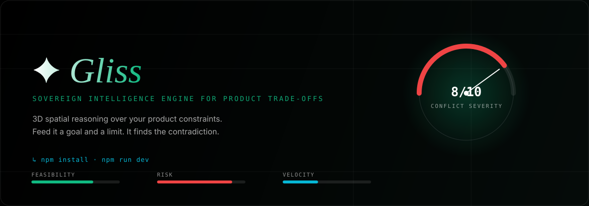
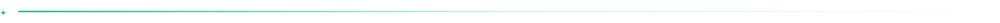
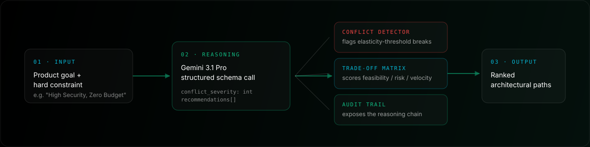

<p align="center">
  <a href="https://decidr-orpin.vercel.app"></a>
  
  
</p>

## What it is

Product decisions rarely fail from a lack of ideas. They fail because a requirement and a constraint quietly contradict each other, and nobody catches it until the build is underway — "high security" promised alongside "zero budget," or "ship this week" alongside "needs full test coverage."

**Gliss** takes a goal and a constraint, runs them through a structured reasoning call, and tells you where they collide — before you commit engineering time to a plan that can't actually hold.

## How it works





You describe a goal and a constraint. Gliss sends both to **Gemini 3.1 Pro** as a structured schema call and gets back three things:

- **Conflict Detector** — a 0–10 severity score for how hard the goal and constraint actually fight each other, with a hard flag past the elasticity threshold.
- **Trade-off Matrix** — every viable path scored on feasibility, risk, and velocity, so you're not choosing blind.
- **Audit Trail** — the model's reasoning chain, so the recommendation isn't a black box you have to take on faith.

## Interface


The UI runs as a scroll-driven 3D scene rather than a form: a particle field that assembles on load, glass panels with real blur and refraction, and a custom cursor that reads as a light source moving through the space. It's built for a portfolio demo first, a daily tool second — worth knowing before you judge it by SaaS-dashboard conventions.

## Stack


Verified against `package.json` and the source, not copied from an old draft:

| Layer | Tech |
|---|---|
| Framework | Next.js 15 (App Router), Tailwind CSS v4 |
| 3D | React Three Fiber, drei, Three.js |
| Motion | `motion` (Framer Motion), Lenis smooth scroll |
| Reasoning | Gemini 3.1 Pro (`@google/genai`), structured JSON schema output |
| UI | Radix-based primitives, `dnd-kit`, `react-markdown` |
| State | React `useState` — no external store |

## Run it locally


**Prerequisites:** Node.js 20+, a Gemini API key.

```bash
git clone https://github.com/akhilreddy59/Gliss.git
cd Gliss
npm install
cp .env.example .env.local   # add your GEMINI_API_KEY
npm run dev
```

Open `http://localhost:3000`. First screen is the loader; give it a few seconds before the app stage mounts.

## Status


Solo project, active development. No license file yet — treat the code as all-rights-reserved until one is added. Issues and forks welcome regardless.
